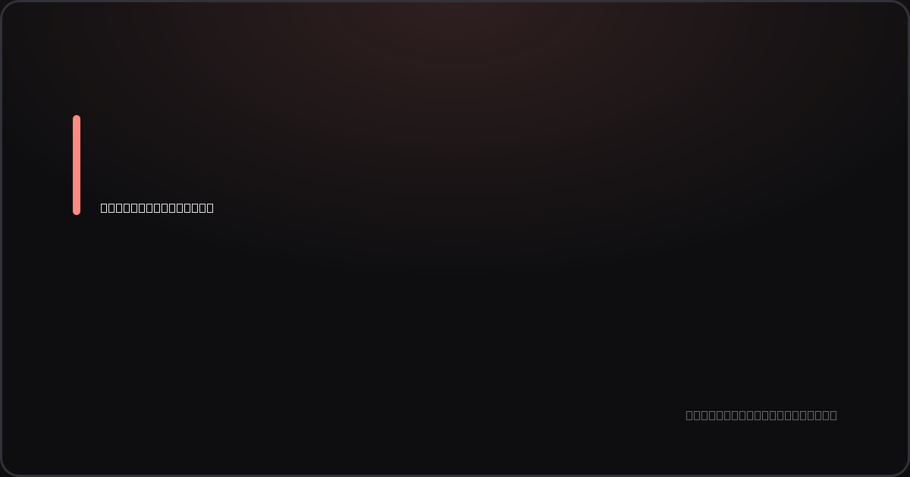

# Website Documentation

Documentation for [yungsamd17.github.io](https://yungsamd17.github.io) - Sam's personal website.

## Table of Contents
- [Tech Stack](#tech-stack)
- [Project Structure](#project-structure)
- [Getting Started](#getting-started)
- [Content Editing](#content-editing)
- [Design System](#design-system)
- [Theme System](#theme-system)
- [Translation System](#translation-system)
- [Toasts](#toasts)
- [Adding a New Language](#adding-a-new-language)
- [Easter Eggs](#easter-eggs)
- [Deployment](#deployment)
- [Commit Message Types](#commit-message-types)

---

## Tech Stack

| Tool | What it does |
|------|--------------|
| [Astro 7](https://astro.build) | Static site framework — zero JS by default |
| [Tailwind CSS 4](https://tailwindcss.com) | Utility-first styling with `@theme` tokens |
| [TypeScript](https://www.typescriptlang.org) | Strict typing across data, i18n and scripts |
| [@fontsource-variable/inter](https://fontsource.org/fonts/inter) | Self-hosted Inter, no font CDN |
| [GitHub Actions](https://github.com/features/actions) | Build & deploy on every push |

---

## Project Structure

```
yungsamd17.github.io/
├── astro.config.mjs         # Astro config (site URL, sitemap filter, Tailwind)
├── package.json
├── tsconfig.json
├── scripts/
│   └── generate-icons.mjs   # sharp: renders PNG icons from public/logo.jpg (prebuild)
├── public/                  # Static files served as-is
│   ├── favicon.ico
│   ├── icon-512.png / icon-maskable.png / apple-touch-icon.png  # generated by prebuild
│   ├── site.webmanifest
│   ├── logo.jpg             # OG image fallback for unlisted routes
│   ├── robots.txt
│   ├── src/assets/          # Legacy asset path (kept for old links)
│   └── downloader/          # BetterDiscord downloader tool (vanilla JS)
├── src/
│   ├── components/
│   │   ├── BaseHead.astro   # SEO meta, per-route OG images, no-FOUC theme/lang script
│   │   ├── Footer.astro
│   │   ├── Icon.astro       # Inline SVG renderer (paths live in src/icons.ts)
│   │   ├── LangToggle.astro # Language toggle button
│   │   └── ThemeToggle.astro
│   ├── data/
│   │   └── site.ts          # All content: socials, featured, projects, links
│   ├── i18n/
│   │   └── ui.ts            # UI strings (en / sk)
│   ├── icons.ts             # SVG path data + IconName union type
│   ├── layouts/
│   │   └── BaseLayout.astro
│   ├── pages/
│   │   ├── index.astro      # Home
│   │   ├── projects.astro   # Build-time GitHub stars via API
│   │   ├── about.astro
│   │   ├── links.astro      # Link-in-bio page (+ copy-email button)
│   │   ├── secret.astro     # Hidden easter egg (excluded from sitemap)
│   │   ├── 404.astro
│   │   └── og/[slug].png.ts # Dynamic 1200×630 OG share cards (sharp)
│   ├── scripts/
│   │   └── app.ts           # Client JS: theme, lang, toasts, age, easter eggs
│   └── styles/
│       └── global.css       # Design tokens (v1 look), components, motion
├── docs/                    # This documentation
└── .github/
    ├── FUNDING.yml
    └── workflows/deploy.yml # Build & deploy to GitHub Pages
```

---

## Getting Started

### Prerequisites

- **Node.js** 22+ (Astro 7 requirement — LTS recommended)
- **npm** (comes with Node)

### Clone & run locally

```bash
git clone https://github.com/yungsamd17/yungsamd17.github.io.git
cd yungsamd17.github.io
npm install     # install dependencies
npm run dev     # dev server at localhost:4321 with hot reload
```

### Production build

```bash
npm run build      # production build → dist/
npm run preview    # serve dist/ locally to verify the build
```

---

## Content Editing

Almost all content lives in **`src/data/site.ts`**:

- `SITE` — name, handle, email, birth date
- `SOCIALS` — home page social icons
- `FEATURED` — featured project cards on home
- `PROJECTS` — cards on `/projects`
- `LINKS` — rows on `/links`

UI labels and toast messages live in **`src/i18n/ui.ts`**. Edit, save, and the dev server hot-reloads.

---

## Design System

The visual design intentionally replicates the original v1 site. Tokens live in `src/styles/global.css` and are mapped into Tailwind via `@theme inline`:

| Token | Dark | Light | Purpose |
|-------|------|-------|---------|
| `--bg` | `#0e0e10` | `#e8e8ec` | Page background |
| `--accent` | `#ff8a80` | `#ff8a80` | Brand coral |
| `--hi` | `#e8e8ec` | `#1a1a1a` | Primary text |
| `--mid` | `#6a6a72` | `#6a6a72` | Secondary text |
| `--lo` | `#32323a` | `#c8c8d0` | Borders, elevated surfaces |
| `--dim` | `#2a2a3080` | `#fafafa80` | Card backgrounds |
| `--item` | `#a0a0a8` | `#4a4a4a` | Link/text items |

Component classes mirror v1: `.page`, `.link-list`, `.featured-link`, `.nav-btn`, `.proj-item`, `.about-text`, `.chip`, `.tag`, plus the radial gradient body background and the 500px column layout.

App-like viewport behavior: `html` gets a definite height and `body` uses `min-height: 100dvh`, so pages fit the visible screen exactly (no browser-toolbar overflow) and only scroll when content genuinely exceeds it.

---

## Theme System

Three modes cycled by the header toggle: **system → light → dark → system**. `system` (monitor icon) is the default and follows the OS preference live.

Two attributes on `<html>` drive everything:

- `data-theme` — the *resolved* theme (`light` / `dark`), used by all CSS tokens
- `data-theme-mode` — the *chosen* mode (`system` / `light` / `dark`), used for the toggle icon (monitor / sun / moon) and resolution

How it works:

1. **No-FOUC:** an inline script in `BaseHead.astro` reads `localStorage['theme']` and applies the resolved theme before first paint
2. **CSS:** tokens flip under `[data-theme="light"]`; dark is the markup default
3. **Persistence:** `localStorage['theme']` stores `'system'`, `'light'` or `'dark'` (older `'light'`/`'dark'` values remain valid)
4. **Live OS changes:** a `matchMedia('(prefers-color-scheme)')` listener re-resolves while in system mode
5. **View Transitions:** `astro:before-swap` copies both attributes onto the incoming page so navigation never resets your choice

---

## Translation System

Fully static bilingual rendering — **both languages are in the HTML**, one is hidden by CSS:

```html
<span data-lang="en">building tools for the web</span>
<span data-lang="sk">tvorím nástroje pre web</span>
```

```css
:root[lang="sk"] [data-lang="en"] { display: none !important; }
```

Language selection flow:

1. **First visit:** the no-FOUC script in `BaseHead.astro` detects the browser languages (`navigator.languages`) — any Slovak variant picks `sk`, everything else picks `en`
2. **Manual switch:** the header toggle flips `en` ↔ `sk`
3. **Persistence:** `localStorage['lang']` always wins over detection on later visits

Switching only sets `<html lang>` + storage — zero content swapping, works without JS after first choice.

---

## Toasts

Manual theme/language changes confirm themselves with a small pill toast (bottom center, auto-hides after 2s):

- Created once by `showToast()` in `app.ts` as `#toast` with `role="status"` for screen readers
- Styled purely from design tokens (`--lo` background, `--hi` text, `--mid` border), so it automatically matches the active theme
- Slide-up + fade animation, disabled under `prefers-reduced-motion`
- **Theme toasts** are localized by the current site language ("Switched to dark theme" / "Prepnuté na tmavú tému")
- **Language toasts** are fixed in the target language ("Switched to English" / "Prepnuté na slovenčinu")
- **Copy-email + konami toasts** reuse the same system (`copiedEmail`, `toastRainbow` keys)

---

## Links Page: Copy Email

The Email row on `/links` has a copy button next to the mailto link. `app.ts` binds `navigator.clipboard.writeText` to any `[data-copy]` element and confirms via toast (localized, with a failure fallback). The button's `aria-label` follows the active language via `updateToggleLabels()`.

---

## Adding a New Language

Example: French (`fr`).

> ⚠️ The header toggle currently assumes two languages (it flips `en` ↔ `sk`). A third language requires turning it into a cycling button or a menu first.

1. **`src/data/site.ts`** — extend the `Locale` type with `'fr'` and add `fr` text to every `desc`
2. **`src/i18n/ui.ts`** — add a `fr` object with all keys from `en` (including the `toastTheme*` keys)
3. **`src/styles/global.css`** — extend the hide rules with every new language pair:
   ```css
   :root[lang="fr"] [data-lang="en"],
   :root[lang="en"] [data-lang="fr"],
   :root[lang="sk"] [data-lang="fr"],
   :root[lang="fr"] [data-lang="sk"] { display: none !important; }
   ```
4. **`src/components/BaseHead.astro`** — extend the browser-language detection (`l?.toLowerCase().startsWith('sk')` → include `'fr'`)
5. **`src/scripts/app.ts`** — extend `currentLang()` and the toggle handler in `initLang()` to cycle three languages
6. **Pages with `data-lang` blocks** (`index.astro`, `projects.astro`, `about.astro`, `404.astro`) — duplicate every marked block with `data-lang="fr"`

---

## Easter Eggs

All preserved from v1, plus one new:

1. **Tagline click** — "building tools" ↔ "building bugs" for 2s (`app.ts`)
2. **Console art** — open DevTools and say hi
3. **`?debug=true`** — green debug border
4. **Konami code** (↑↑↓↓←→←→BA) — rainbow hue-cycle for 8s + toast

There is one more. It is not documented here — that would ruin the fun.

---

## Dynamic OG Images

`src/pages/og/[slug].png.ts` prerenders 1200×630 share cards (coral accent bar, handle, page title, tagline) for `/`, `/about`, `/projects` and `/links` using sharp. `BaseHead.astro` maps each route to its card and upgrades `twitter:card` to `summary_large_image`; any other route (e.g. `/secret`) falls back to `logo.jpg` + `summary`.

Example — home page card (`docs/assets/og/`):



Text rendering needs a system font (DejaVu Sans or similar). GitHub Actions' `ubuntu-latest` has one preinstalled; on a bare Linux container without fonts, export `FONTCONFIG_FILE` pointing at a config that includes your font directory.

---

## GitHub Stars on /projects

Projects with a `repo: 'owner/name'` field in `site.ts` get a live star count, fetched from the GitHub API **at build time** (no client JS, no rate-limit issues at runtime). Lookups fail soft: if the API is unreachable or rate-limited, the star chip is simply omitted and the build still succeeds. Language dots use the `LANG_COLORS` map in `projects.astro`.

---

## Icons & Manifest

`npm run build` triggers `scripts/generate-icons.mjs` (prebuild), which renders `icon-512.png`, `apple-touch-icon.png` (180×180) and a maskable variant from `public/logo.jpg` via sharp. `site.webmanifest` references them; `BaseHead.astro` links the manifest and apple-touch-icon.

---

## Downloader

`/downloader` is a standalone vanilla-JS tool (no Astro) for downloading plugins/themes from [yungsamd17/BetterDiscordAddons](https://github.com/yungsamd17/BetterDiscordAddons). See `public/downloader/README.md` for the query format — single files (`?plugin=Name`) and batches (`?plugin=A&plugin=B&theme=C`) both work; downloads run sequentially with per-file status rows. The UI follows the site's dark/light tokens via `prefers-color-scheme` and uses inline SVG icons only (no icon CDN).

---

## Deployment

Automatic via **`.github/workflows/deploy.yml`** (official `withastro/action`):

1. Push to `main` → site builds and deploys
2. Manual runs possible via **Actions → Deploy to GitHub Pages → Run workflow**
3. One-time setup: repo **Settings → Pages → Source → GitHub Actions**

Sitemap is generated at `/sitemap-index.xml` by `@astrojs/sitemap`.

---

## Commit Message Types

Recommended commit message format for this project:

### Types:
- **feat** - New features (easter eggs, new pages, etc.)
- **fix** - Bug fixes (typos, broken functionality)
- **style** - UI/UX changes (CSS updates, layout changes)
- **refactor** - Code cleanup without changing functionality
- **docs** - Documentation updates (README, comments)
- **perf** - Performance improvements
- **chore** - Maintenance (updating deps, configs)

### Examples:
```
feat: add rainbow theme easter egg
fix: correct translation typo in Slovak about text
style: update project card hover effects
refactor: remove unused rainbow theme code
docs: add documentation for language system
chore: bump astro to latest
```

---

## License

This project is licensed under the MIT License - see the [LICENSE](../LICENSE) file for details.

---

**Last updated:** August 2026
